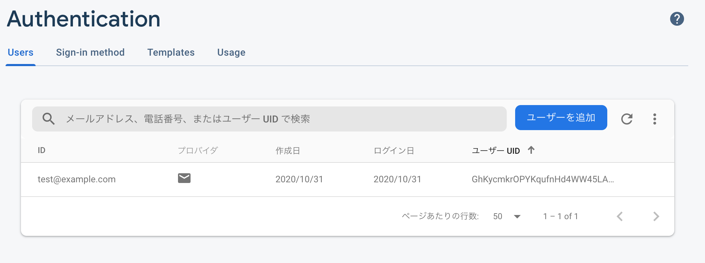

# firebase x Go言語の認証サンプル

## 事前準備
### 1. .envを作成

- .env.sampleから.envファイルを複製

### 2. firebaseでプロジェクトとアプリを追加


- アプリはWeb（javascript）でCDKでソースコードが生成されて変数`firebaseConfig`の中身を.envに記載


### 3. プロジェクトの設定からサービスアカウントを作成して、秘密鍵をダウンロード

- プロジェクトルートに置く


### 4. ユーザを追加



### 5. アプリを起動

```shell script
$ go run main.go
```

or

```shell script
$ go build

$ ./firebase-sample
```

### 6. 4で作成したユーザのemailとpasswordを入力して


### 7. 6で発行したトークンを入力してログインボタンを押す


### 7. 画面が遷移されてemailが表示されば、認証成功


